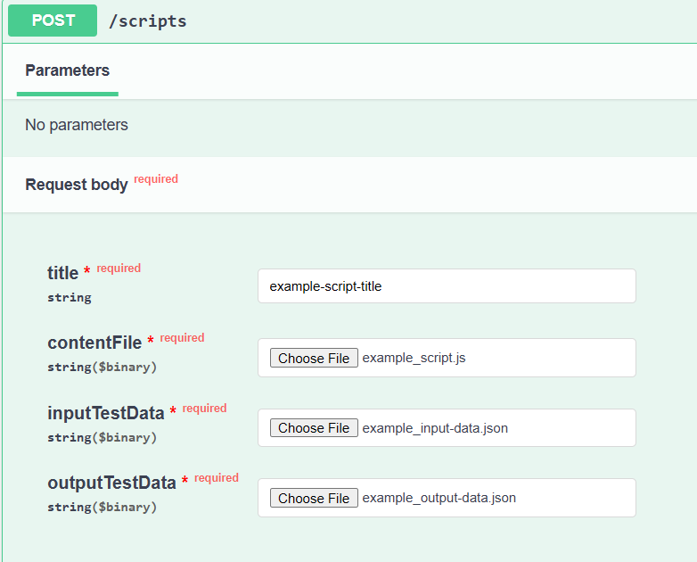

[](https://github.com/AugustoRengel/script-hive/actions/workflows/codeql.yml)
[](https://codecov.io/github/AugustoRengel/script-hive)
 
 # 🛠️ script-hive

**ScriptHive** é uma plataforma de execução e gestão de scripts, 
projetada para automatizar transformações de dados de forma segura e escalável. 
O sistema permite armazenar scripts em JavaScript, executá-los de maneira assíncrona, 
acompanhar suas execuções e persistir os resultados em um banco de dados.

---

## 📌 Tecnologias e Arquitetura

- **.NET 9**
- **Entity Framework Core**
- **PostgreSQL (Docker)**
- **Swagger UI**
- **JWT Authentication**
- **Arquitetura DDD (Domain-Driven Design)**
- **API REST**
- **Docker + Docker Compose**

---

## 📂 Endpoints

- `/auth` – Login, geração de token - Public
- `/users` – Gerenciar users (CRUD) - Admin only
- `/scripts` – Gerenciar scripts (CRUD) - Admin and User
- `/executions` – Executar scripts e acompanhar status/resultados - Admin and User

---

## 🧱 Estrutura do Projeto

```
script-hive/
│
├── src/ 
│	├── ScriptHive.Api				# Camada de apresentação com endpoints REST, injeção de dependências e autenticação JWT
│	├── ScriptHive.Application		# Contém casos de uso, DTOs, validações e interfaces de serviços.
│	├── ScriptHive.Domain			# Contém entidades, value objects e interfaces de repositórios e filas.
│	├── ScriptHive.Infrastructure	# Contém implementações de repositórios, contexto EF e implementação da fila em memória.
│	├── ScriptHive.Worker			# Worker que atua em background para persistir os resultados dos scripts executados.
│	└── ScriptHive.ScriptExecutor	# Execução de scripts .js com Jint
├── tests 
│	└── ScriptHive.Tests			# Testes unitários
├── docker-compose.yml				# Orquestração dos containers
└── README.md						# Este arquivo
```

---

## 👨‍💻 Autenticação

- Baseada em **JWT**
- Login no endpoint `/auth/login`
- Autorização via `[Authorize]` nos endpoints protegidos

---

## 🚀 Como rodar o projeto (Git Bash + Docker)

### ⚙️ Pré-requisitos

- Docker Desktop instalado e rodando
- Git Bash (ou terminal compatível com Unix-like shell no Windows)

---

### 🧾 1. Clone o repositório

```bash
git clone git@github.com:AugustoRengel/script-hive.git
cd script-hive
```

---

### 🐳 2. Suba os containers

```bash
docker compose up --build
```

Este comando irá:
- Construir a imagem da API
- Criar o banco `script_hive` (PostgreSQL)
- Aplicar as **migrations**
- Popular a tabela User um um Admin
- Aguardar o banco estar pronto e conectar a API
- Iniciar a API na porta `http://localhost:5351`

---

### 🔎 3. Acesse o Swagger

Após os containers subirem, acesse:

```
http://localhost:5351/swagger
```

---

### 🔐 4. Login com JWT (para acessar endpoints protegidos)

1. Na UI Swagger acesse **GET** `/auth/login`
2. Use as credenciais geradas pelo seed:

```json
{
  "username": "Admin",
  "password": "admin@123"
}
```

3. Copie o token JWT retornado
4. No Swagger, clique em **Authorize** e cole o token (sem `Bearer`)

---

### 🔎 5. Exploração da API

A partir desse ponto é possivel consumir o recurso que desejar do sistema, vamos ver um exemplo de uso:

1. Utilize os arquivos da pasta `docs/example-data/` nos proximos passos:
    - [📄 Script exemplo - example_script.js](docs/example-data/example_script.js)
    - [📄 Dados de input - example_input-data.json](docs/example-data/example_input-data.json)
    - [📄 Dados de output esperados - example_output-data.json](docs/example-data/example_output-data.json)
      
2. Acesse **POST** `/scripts` e cadastre um script inserido o titulo e os arquivos baixados



3. Execute e confirme que obteve retorno 201 com o `id` do script cadastrado
4. Acesse **POST** `/executions/{id}`
5. Insira o `id` salvo e o arquivo de input salvo
6. Execute e confirme que obteve o retorno 202 com o `id` da execução
7. Acesse **GET** `/executions/{id}`
8. Execute e confirme que o retorno contem o `result` e `status` a seguir:

```json
{
  "id": "072f670c-4432-45be-a0cc-7ccc12d097e4",
  "result": [
    {
      "trimestre": "20232",
      "nomeBandeira": "VISA",
      "qtdCartoesEmitidos": 3050384,
      "qtdCartoesAtivos": 1716709,
      "qtdTransacoesNacionais": 43984902,
      "valorTransacoesNacionais": 12846611557.78
    }
  ],
  "status": "Completed",
  "startedAt": "2025-08-21T12:44:04.76238Z",
  "finishedAt": "2025-08-21T12:44:04.782299Z"
}
```

---

## 🧰 Outras ações

### 🧼 Resetar o ambiente (limpar banco e containers)

```bash
docker-compose down --volumes
```

Esse comando remove os containers **e o volume do banco**, permitindo um ambiente novo ao rodar `up` novamente.

---

## 🧪 Testes

Os testes unitários podem ser executados com:

```bash
dotnet test .\ScriptHive.sln
```

Requer .NET SDK 9 localmente instalado.
